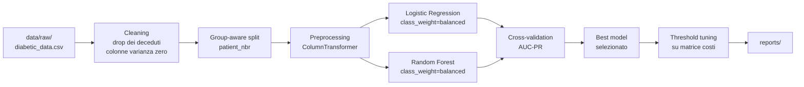

# Primo modello

:::tip Obiettivo della lezione
Eseguire il **primo training reale**, capire cosa fa ogni step della pipeline e leggere i file di output. Niente magia, niente "black box".
:::

## Notebook di riferimento

`notebooks/03_models_logreg_vs_ensemble.ipynb` — corrisponde, in versione interattiva, a quello che fa lo script `readmit-train`.

## Step 1 — Esegui il training

```bash
# Smoke test (~1 minuto): saltato il tuning, solo per validare la pipeline
readmit-train --quick

# Training completo (~5–15 minuti): tuning di alcuni iperparametri
readmit-train
```

Mentre gira, leggi qui sotto cosa sta succedendo dentro.

## Cosa fa la pipeline (concettualmente)



### Cleaning

- Rimozione dei record con dimissione terminale (deceduti, hospice).
- Rimozione delle colonne `examide`, `citoglipton` (varianza zero) e `weight` (~97% missing).
- Conversione di `?` in `NaN` per imputazione esplicita downstream.
- Binarizzazione del target: `readmitted_30d = (readmitted == "<30").astype(int)`.

### Group-aware split

```python
from sklearn.model_selection import GroupShuffleSplit

splitter = GroupShuffleSplit(n_splits=1, test_size=0.2, random_state=42)
train_idx, test_idx = next(splitter.split(X, y, groups=df["patient_nbr"]))
```

Garantisce che **un paziente non finisca contemporaneamente in train e in test**.

### Preprocessing (ColumnTransformer)

```python
from sklearn.compose import ColumnTransformer
from sklearn.pipeline import Pipeline
from sklearn.preprocessing import StandardScaler, OneHotEncoder
from sklearn.impute import SimpleImputer

numeric_pipe = Pipeline([
    ("imputer", SimpleImputer(strategy="median")),
    ("scaler",  StandardScaler()),
])

categorical_pipe = Pipeline([
    ("imputer", SimpleImputer(strategy="constant", fill_value="Unknown")),
    ("ohe",     OneHotEncoder(handle_unknown="ignore", min_frequency=10)),
])

preprocessor = ColumnTransformer([
    ("num", numeric_pipe,     numeric_cols),
    ("cat", categorical_pipe, categorical_cols),
    ("diag", icd9_grouper,    ["diag_1", "diag_2", "diag_3"]),
])
```

Il dettaglio chiave: `icd9_grouper` è un trasformatore custom che mappa i ~700 codici ICD-9 in **9 macro-categorie** cliniche (circolatorie, respiratorie, diabete, ecc.). Vedi *Teoria → 03 Preprocessing*.

### Modelli a confronto

```python
models = {
    "logistic_regression": LogisticRegression(
        class_weight="balanced", max_iter=1000, C=1.0
    ),
    "random_forest": RandomForestClassifier(
        class_weight="balanced", n_estimators=200, max_depth=12, n_jobs=-1
    ),
}
```

Entrambi con `class_weight="balanced"` per gestire lo sbilanciamento.

### Cross-validation

5-fold `GroupKFold` (gruppo = `patient_nbr`). Per ogni fold:

1. Fit del preprocessing **solo sul train fold**.
2. Predict del probability score sul validation fold.
3. Calcolo di **AUC-PR** (metrica primaria).

Risultato → `reports/cv_summary.csv` con mean ± std per modello.

### Threshold tuning

Sul fold di validation (o sul train con CV), si cerca la soglia $\tau$ che minimizza:

$$
\mathcal{L}(\tau) = \text{FP}(\tau) + 5 \cdot \text{FN}(\tau)
$$

(rapporto costi `COST_FN_OVER_FP = 5`). Vedi *Teoria → 05 Metriche*.

## Step 2 — Output prodotti

Dopo `readmit-train` la cartella `reports/` contiene:

```
reports/
├── models/
│   └── best_model.joblib              # pipeline serializzata (preprocess + clf)
├── cv_summary.csv                     # AUC-PR per modello in CV
├── holdout_metrics.json               # metriche finali sul test set
├── fairness_summary.csv               # gap di fairness (race, age)
├── fairness_report.csv                # metriche per sottogruppo
└── figures/
    ├── roc_curve.png
    ├── pr_curve.png
    └── confusion_matrix.png
```

## Step 3 — Leggi `cv_summary.csv`

Esempio:

| model | mean_auc_pr | std_auc_pr | n_folds |
|---|---|---|---|
| logistic_regression | 0.232 | 0.011 | 5 |
| random_forest       | 0.245 | 0.013 | 5 |

Letto come:

- **Baseline naturale** (positivi random): ~0.11 (prevalenza).
- **LogReg AUC-PR ≈ 0.23**: ~2x meglio del random. Coerente con la letteratura (Strack 2014 ottiene numeri simili).
- **RF leggermente meglio**, ma il gap è < 1 std → **non statisticamente significativo**.
- **Lezione**: su questo dataset, *il modello più complesso non vince per molto*. Il valore del progetto è altrove (fairness, interpretabilità).

## Step 4 — Leggi `holdout_metrics.json`

Esempio:

```json
{
  "model": "logistic_regression",
  "auc_pr": 0.231,
  "auc_roc": 0.658,
  "threshold_default_0.5": {
    "precision": 0.18,
    "recall": 0.42,
    "f1": 0.25,
    "tp": 612, "fp": 2728, "tn": 12871, "fn": 836
  },
  "threshold_optimal_costsens": {
    "tau": 0.27,
    "precision": 0.14,
    "recall": 0.71,
    "f_beta_2": 0.36,
    "tp": 1028, "fp": 6302, "tn": 9297, "fn": 420
  }
}
```

Come leggerlo:

- **Soglia 0.5** → recall del 42%: **il modello "manca" il 58% dei riammessi**. Inaccettabile clinicamente.
- **Soglia ottima 0.27** → recall del 71%, precision 14%. Recuperiamo molti più pazienti riammessi (TP da 612 a 1028), al prezzo di più falsi positivi (FP da 2.7k a 6.3k).
- **Trade-off chiaro**: ogni FN evitato costa ~9 FP in più. È accettabile se il programma di follow-up ha capacità.

## Step 5 — Guarda le figure

`reports/figures/roc_curve.png` e `pr_curve.png`:

- ROC: l'AUC è ~0.66, sembra ok. **Ma fuorviante** su classi sbilanciate.
- PR: l'AUC è ~0.23, baseline 0.11. **Questa è la metrica vera**.

`confusion_matrix.png`: visualizza i TP/FP/TN/FN alla soglia scelta.

## Esercizi guidati

**E1.** Rilancia il training con `COST_FN_OVER_FP = 10` (modifica `src/readmit_pipeline/config.py`). Come cambia $\tau$ ottima? E recall/precision?

**E2.** Aggiungi nei modelli un terzo classifier (es. `GradientBoostingClassifier`). Inseriscilo in `models = {…}` e rilancia. AUC-PR è migliore di RF? Di quanto?

**E3.** In `cv_summary.csv` calcola "best - second_best" diviso per la deviazione standard del best. Se < 1, **non scegliere quel modello come "vincitore definitivo"**: la differenza è dentro al rumore della CV.

**E4.** Apri `best_model.joblib` con `joblib.load()` e ispeziona la pipeline: quanti step ci sono? Quante feature in uscita dal preprocessing?

## Cose da annotare per il report finale

1. **AUC-PR media e std** dei due modelli (CV).
2. **AUC-PR sul test set** del modello vincente.
3. **Recall / precision** alla soglia 0.5 **e** alla soglia ottima.
4. **Soglia ottima** $\tau^*$ e la matrice costi usata.
5. **Confusion matrix** alla soglia ottima.
6. **Confronto qualitativo**: LogReg vs RF — la differenza è significativa?

## Prossimo passo

[**Leggi le metriche**](./04-leggi-le-metriche.md): approfondisci AUC-PR, F-β e curva precision-recall. Capisci perché lo "stesso AUC-ROC" può nascondere modelli molto diversi.
